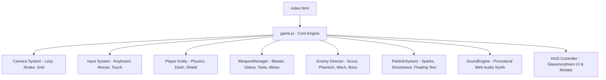

# ⚡ CYBER NEON ROGUE // OVERDRIVE ARCADE

<div align="center">

```
  ██████╗██╗   ██╗██████╗ ███████╗██████╗     ███╗   ██╗███████╗ ██████╗ ███╗   ██╗
 ██╔════╝╚██╗ ██╔╝██╔══██╗██╔════╝██╔══██╗    ████╗  ██║██╔════╝██╔═══██╗████╗  ██║
 ██║      ╚████╔╝ ██████╔╝█████╗  ██████╔╝    ██╔██╗ ██║█████╗  ██║   ██║██╔██╗ ██║
 ██║       ╚██╔╝  ██╔══██╗██╔══╝  ██╔══██╗    ██║╚██╗██║██╔══╝  ██║   ██║██║╚██╗██║
 ╚██████╗   ██║   ██████╔╝███████╗██║  ██║    ██║ ╚████║███████╗╚██████╔╝██║ ╚████║
  ╚═════╝   ╚═╝   ╚═════╝ ╚══════╝╚═╝  ╚═╝    ╚═╝  ╚═══╝╚══════╝ ╚═════╝ ╚═╝  ╚═══╝
```

### 🎮 An Adrenaline-Fueled Sci-Fi Roguelite Survival Arcade

*100% Offline Ready • Zero Dependencies • Procedural Web Audio Synth • 60 FPS Canvas Vector Engine*

[](#-quick-start--cara-main-offline)
[](LICENSE)
[](https://developer.mozilla.org/en-US/docs/Web/API/Canvas_API)
[](https://developer.mozilla.org/en-US/docs/Web/API/Web_Audio_API)
[](#)
[](#-deployment-to-github-pages)

[Play Live Demo](#-deployment-to-github-pages) • [Key Features](#-key-features) • [Controls](#-controls--kontrol) • [Architecture](#-tech-stack--architecture) • [Customization](#-customization--modding)

</div>

---

## 🚀 Quick Start / Cara Main Offline

Game ini dirancang **100% mandiri (Self-Contained)**. Kamu tidak perlu menginstall Node.js, tidak perlu menjalankan terminal, dan tidak butuh internet!

```bash
# Cukup buka File Explorer, lalu KLIK GANDA (double-click):
index.html
```

Game akan langsung terbuka dan berjalan mulus di browser (Google Chrome, Microsoft Edge, Mozilla Firefox, Brave, Opera, atau Safari).

---

## 📖 Story & Lore

> *Tahun 2099. Kesadaranmu terperangkap dalam jaringan mainframe AI yang memberontak. Dikelilingi oleh ribuan drone pembunuh rogue yang terus bermutasi, satu-satunya jalan keluar adalah bertahan hidup, memanen inti energi (Energy Cores), memperkuat modul tempur cybernetic, dan mengeliminasi sang **Apex Overlord Core**!*

---

## 🌟 Key Features

- **⚡ 100% Pure Code & Zero Dependencies**:
  - Tanpa file gambar bitmap atau audio MP3 berat.
  - **Procedural Neon Vector Graphics**: Semua pesawat, drone musuh, proyektil plasma, dan ledakan digambar secara dinamis via HTML5 Canvas dengan efek bloom glow.
  - **Procedural Web Audio Synthesizer**: Suara tembakan laser, ledakan bass bergetar, denting kristal XP, hingga musik Synthwave retro 80-an disintesis langsung saat game berjalan!
- **🌀 Deep Roguelite Weapon Synergy**:
  - **Pulse Blaster**: Tembakan plasma beruntun dengan augmentasi multi-shot & piercing.
  - **Orbital Glaives**: Cakram laser cybernetic berputar yang mencabik-cabik kerumunan musuh.
  - **Tesla Arc**: Sengatan petir berantai yang melompat ke banyak target secara simultan.
  - **Quantum Mines**: Ranjau proksimitas dengan ledakan shockwave gravitasi tinggi.
- **🛡️ Tactical Combat & Survival**:
  - **Rechargeable Energy Shield**: Menyerap damage sebelum mengurangi Hull HP.
  - **Cyber Dash**: Manuver kilat berkecepatan tinggi dengan efek kebal (*invulnerability frames* / i-frames).
  - **Dynamic Wave Director**: Kerumunan musuh bertambah banyak dan agresif seiring berjalannya waktu.
  - **Apex Overlord Boss**: Bos raksasa dengan pola peluru melingkar (*bullet hell*) dan bar HP di layar.
- **📺 Retro Arcade Aesthetics**:
  - Filter **CRT Scanline & Vignette** bawaan arcade 80-an (tekan tombol `C` untuk toggle).
  - Floating Critical Combat Text & Screen Shake dinamis.
  - Radar Minimap taktis di sudut kanan bawah.
- **📱 Cross-Platform Responsive**:
  - Mendukung kontrol Keyboard & Mouse di PC/Laptop.
  - Mendukung *Virtual Joystick* & tombol sentuh di smartphone / tablet.

---

## 🕹️ Controls / Kontrol

| Tombol / Input | Aksi |
| :--- | :--- |
| **`W`, `A`, `S`, `D`** / **Tombol Panah** | Menggerakkan Operatif Cyber |
| **`Kursor Mouse`** | Membidik Arah Tembakan (Auto-Fire aktif) |
| **`Spasi`** / **`Shift`** | **Cyber Dash** (Kebal dari serangan saat melesat) |
| **`P`** / **`Escape`** | Jeda Permainan (Pause) & Menu Upgrade |
| **`M`** | Mematikan / Menyalakan Audio & Musik BGM |
| **`C`** | On / Off Filter Retro CRT Scanlines |
| **Touch Screen (HP/Tablet)** | Virtual Joystick (kiri) & Tombol Dash (kanan) |

---

## 🏗️ Tech Stack & Architecture

Proyek ini menggunakan arsitektur pemrograman berorientasi objek yang bersih dan modular:



### 📁 Directory Layout

```
cyber-neon-rogue/
├── index.html                 # Game runner utama (Tinggal klik ganda!)
├── game.js                    # Core engine mandiri (Offline, zero-CORS)
├── styles/
│   └── style.css              # Cyberpunk HUD, glassmorphism, & CRT scanlines
├── src/                       # Source code modular terpisah (ES6)
│   ├── main.js                # App bootstrap
│   ├── core/                  # Game loop, Camera & Input
│   ├── entities/              # Player, Enemy, Weapon & Drop
│   ├── systems/               # Particle, Upgrade & Wave director
│   ├── audio/                 # Web Audio synthesizer
│   └── ui/                    # HUD telemetry
├── .github/
│   └── workflows/
│       └── deploy.yml         # GitHub Actions untuk deploy 1-klik ke GitHub Pages
├── start_game.bat             # Windows launcher alternatif
├── .gitignore                 # File ignore git
├── LICENSE                    # Lisensi Open-Source MIT
└── README.md                  # Dokumentasi portofolio profesional
```


## ️ Customization & Modding

Mau menambahkan senjata baru atau mengubah keseimbangan game? Sangat mudah:
- **Menambah Upgrade**: Buka `game.js` dan tambahkan kartu baru di array `UPGRADE_CATALOG`.
- **Mengatur Damage & Fire Rate**: Sesuaikan parameter di class `WeaponManager`.
- **Eksperimen Suara**: Modifikasi frekuensi osilator di class `SoundEngine`.

---

## 👨‍💻 Author

Dibuat oleh **ZHAFRAN**  
*Silakan hubungkan profil sosial mediamu di sini:*
- GitHub: [@username](https://github.com/kenkaiken67)
- LinkedIn: [Your Profile](https://www.linkedin.com/in/muh-zhafran-ridwan-putra-370a93410/)

---

## 📄 License

Proyek ini dilisensikan di bawah lisensi open-source **[MIT License](LICENSE)**. Bebas untuk digunakan, dimodifikasi, dan dicantumkan dalam portofolio pribadi.

<div align="center">
  <b>⭐ Jangan lupa berikan Star di GitHub jika kamu menyukai game ini! ⭐</b>
</div>
